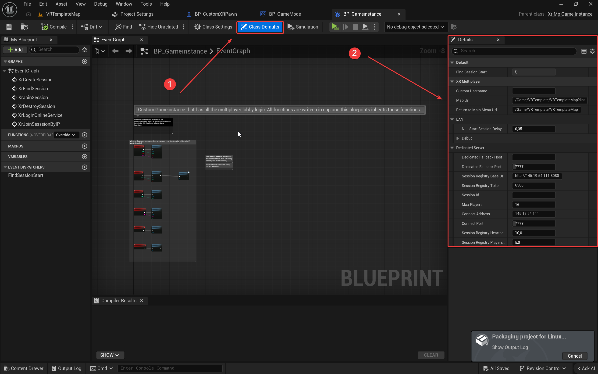
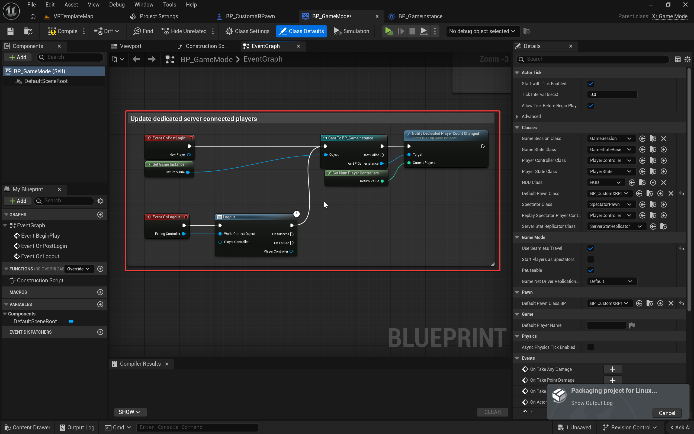
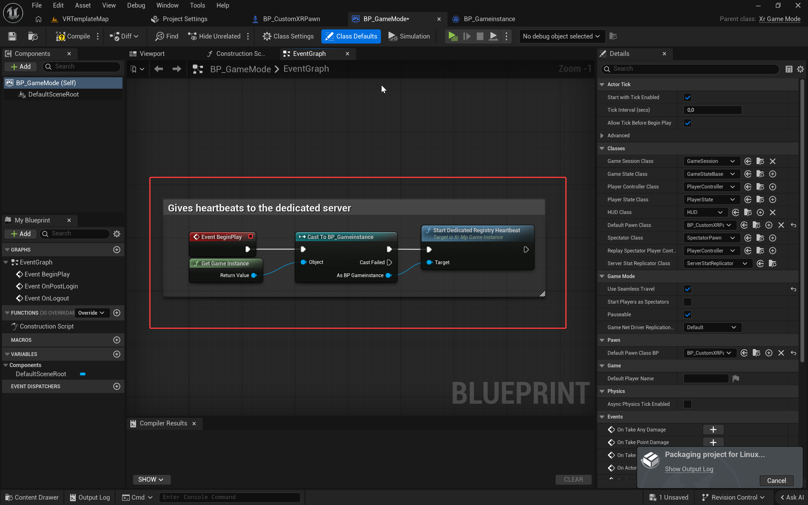

# EduXR Multiplayer Plugin

A robust multiplayer networking solution for Unreal Engine 5, specifically designed for educational XR experiences. This plugin provides seamless integration between Epic Online Services (EOS) and local LAN networking, featuring full VR tracking replication and optimized movement.

---

## Key Features

### Versatile Networking
- **Dual Mode Support**: Seamlessly switch between Epic Online Services (EOS) for global P2P and the Null subsystem for local LAN play.
- **Dedicated Server Support**: Built-in support for dedicated server discovery via custom HTTP registry APIs.
- **Explicit Network Flow**: Clear state management with `None`, `Local`, `Online`, and `Dedicated` modes.

### Advanced VR Replication
- **Full Tracking Sync**: High-frequency replication of HMD and motion controller transforms.
- **Origin-Relative Logic**: Tracking is synced relative to the VR Origin, ensuring stability regardless of pawn orientation or movement.
- **Optimized Performance**: Uses unreliable Server RPCs for smooth, low-latency tracking updates.

### Smooth Locomotion and Physics
- **VR Movement Component**: Custom movement component handling locomotion, snap turning, and gravity.
- **Client-Side Prediction**: Instant responsiveness for the local player with server-reconciled movement.
- **Refined Collision**: Slim capsule collider design to minimize wall clipping and prevent physics-based "launch" bugs.

### Virtual Reality Interaction
- **C++ VR Keyboard**: A high-performance QWERTY keyboard built in Slate, accessible via world-space UI.
- **Smart Focus System**: Button-driven text box targeting, allowing players to select exactly where they want to type.
- **Widget Interaction**: Pre-configured `WidgetInteractionComponent` logic for seamless UMG interaction in VR.

---

## Requirements

- **Unreal Engine**: 5.7.3 (Recommended)
- **Target Platform**: Windows (Primary), Linux (Server)
- **Plugins**: Online Subsystem EOS (Optional, for online play)

---

## Installation

1. Navigate to your Unreal Engine project's `Plugins` folder (create it if it doesn't exist).
2. Clone this repository into that folder:
   ```bash
   git clone https://github.com/jrcz-data-science-lab/EduXR-Multiplayer.git
   ```
3. Restart the Unreal Editor.
4. Enable **OpenXR Multiplayer** in `Edit -> Plugins`.

### Building for Linux (Dedicated Server)

For detailed instructions on cross-compiling your Unreal Engine project for Linux, refer to this guide:
- **[Unreal Engine Linux Cross-Compilation Guide](https://www.youtube.com/watch?v=kzVzy87qELQ)**

This covers setting up the toolchain and packaging dedicated server builds.

---

## Quick Start

### 1. Game Instance Configuration
Set your project's Game Instance to inherit from `XrMpGameInstance`.
- **Blueprint**: Create a new Blueprint based on `XrMpGameInstance` and set it in `Project Settings -> Maps & Modes`.

### 2. Pawn Setup
Use `CustomXrPawn` as the base class for your VR player. This pawn includes all necessary components for replicated VR movement and tracking.

### 3. Network Configuration
Add the following to your `Config/DefaultEngine.ini` to ensure proper net driver routing:

```ini
[/Script/Engine.Engine]
!NetDriverDefinitions=ClearArray
+NetDriverDefinitions=(DefName="GameNetDriver",DriverClassName="/Script/OnlineSubsystemUtils.IpNetDriver",DriverClassNameFallback="/Script/SocketSubsystemEOS.NetDriverEOSBase")

[OnlineSubsystem]
DefaultPlatformService=Null

[OnlineSubsystemEOS]
bEnabled=true

[OnlineSubsystemNull]
bEnabled=true
```

### 4. Basic Blueprint Usage

- **Host a Session**: Use the `Host Session` node. Specify `Max Players`, `Is LAN`, and `Server Name`.
- **Find Sessions**: Use the `Find Sessions` node. Bind to `OnFindSessionsComplete_BP` to receive results.
- **Join Session**: Pass a session result to the `Join Session` node.

### 5. Dedicated Registry Configuration
Use your `XrMpGameInstance`-derived Blueprint defaults to set dedicated registry values:

- `SessionRegistryBaseUrl`: Example `http://<registry-ip>:8080`
- `SessionRegistryToken`: Your registry bearer token
- Optional: `ConnectAddress`, `ConnectPort`, `MaxPlayers`

If your dedicated server receives `SESSION_ID` at launch, `StartDedicatedRegistryHeartbeat` can send heartbeat and player count updates to the registry.

### 6. Blueprint Screenshots
Store screenshots in `Plugins/OpenXrMultiplayer/Docs/Images/` and keep these filenames so they render automatically:

- `gameinstance-dedicated-settings.png`
- `gamemode-playercount-flow.png`
- `gamemode-heartbeat-flow.png`





---

## Architecture and How It Works

### Network Mode Flow
The plugin initializes in `EXrNetworkMode::None`. The player must explicitly choose a mode (Local, Online, or Dedicated) before hosting or searching. This prevents unwanted EOS login prompts during LAN-only sessions.

### Tracking Replication
The `CustomXrPawn` captures local HMD and controller transforms relative to the `VrOrigin` and sends them to the server via `ServerUpdateVRTransforms`. Other clients then interpolate these values onto their proxy pawns, ensuring smooth visual representation.

---

## API Reference Summary

### XrMpGameInstance
- `SetNetworkMode(EXrNetworkMode NewMode)`: Switches the active networking subsystem.
- `LoginOnlineService()`: Triggers the EOS login flow (Online mode only).
- `HostSession(...)`: Creates a lobby or LAN session.
- `FindSessions(...)`: Searches for available matches.

### VR Keyboard
- `SetTargetTextBox(UEditableTextBox* Target)`: Routes keyboard input to a specific UI element.
- `OnKeyboardTextCommitted`: Event fired when the player presses 'Enter'.

---

## License
This project is licensed under the terms provided in the [LICENSE](LICENSE) file.

---
*Developed for the EduXR Ecosystem by the JRCZ Data Science Lab.*

